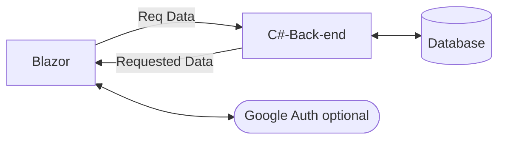
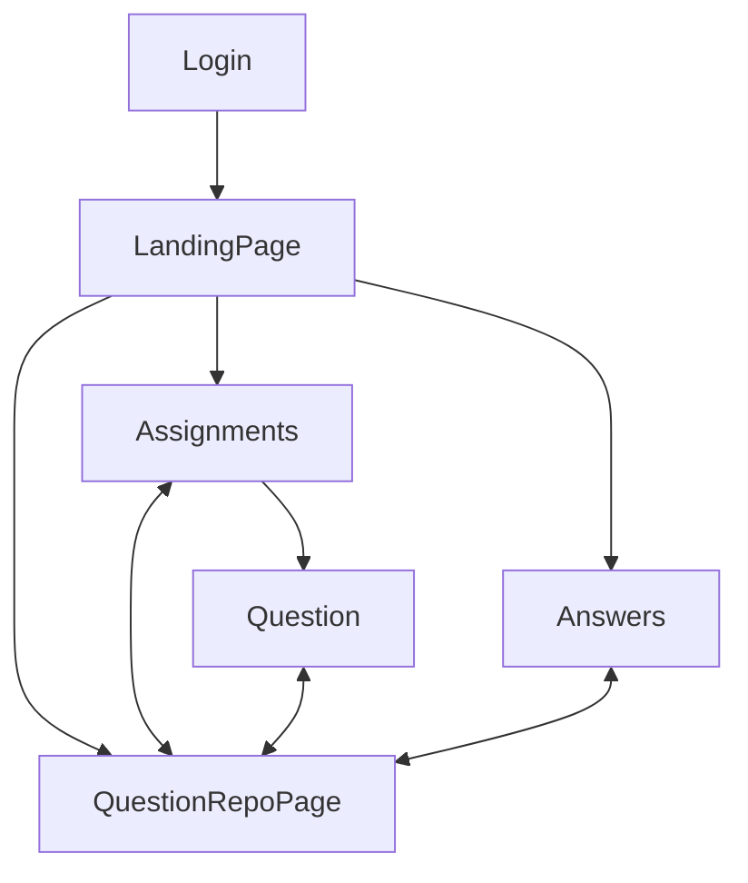
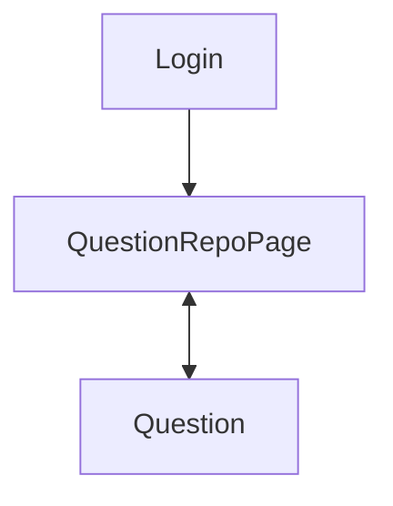
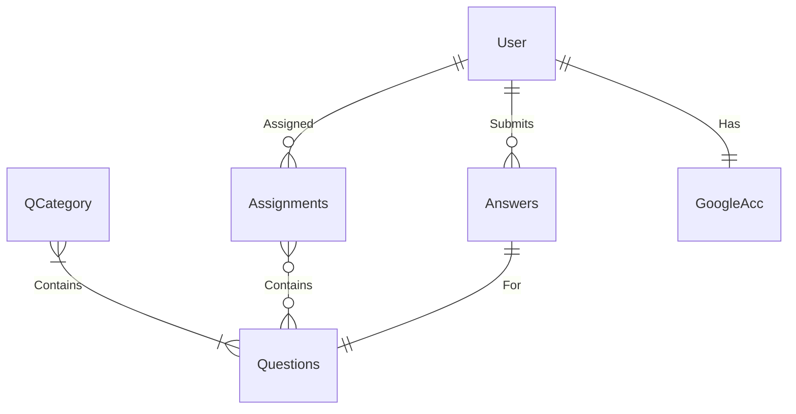
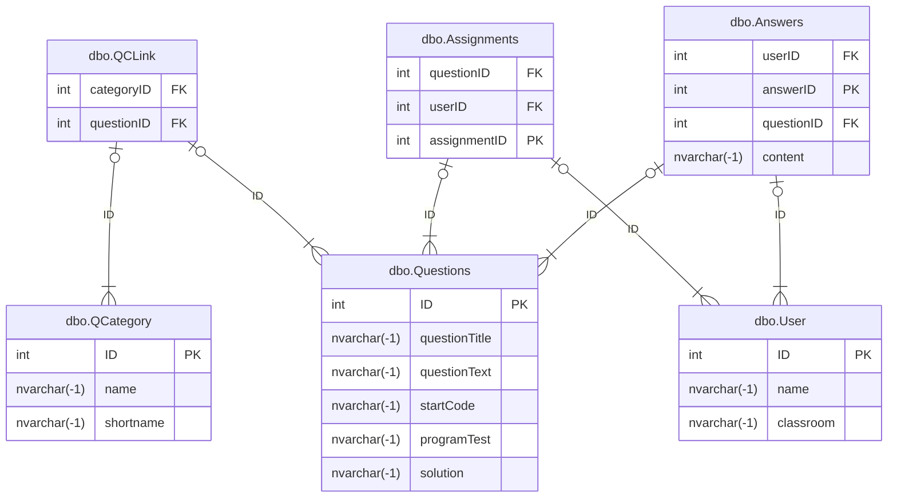

## Analysis
### The Product

- The product of my NEA project will be a dedicated website for computer science questions. This platform will enable teachers to assign questions to students, contribute their own questions to a central repository, and evaluate each student's progress effectively.
- From the student’s viewpoint, they will be able to log in using Google authentication. Once logged in, students can view their assigned tasks, access assignments, and respond to questions. The system may potentially automatically mark their answers, though this feature will only apply to questions with fixed, objective answers (i.e., not open-ended or interpretative writing).

### The Research

- I have explored several educational platforms, including Duolingo and Isaac Physics/Computing, from a student’s perspective. This exploration has provided me with valuable insights into user interfaces and how to make the learning experience engaging and user-friendly.
- The questions integrated into the platform will be sourced from the computer science department at my school, ensuring relevance and alignment with the curriculum.

### The Client

- I have identified the computer science department as my primary client for testing this NEA project. Throughout the development process, I will be collaborating with and seeking feedback from faculty members within the department to enhance the product.

### The Objectives
- **Must-Haves**
	1. Establish a reliable client-server connection.
	2. Create a comprehensive collection of questions.
	3. Ensure accessible question retrieval via the website.
- **Should-Haves** 
	1. Implement individual student authentication. 
	2. Enable teachers to receive submitted answers from students. 
	3. Facilitate storage of answers for future review.
- **Could-Haves** 
	1. Introduce randomised question variables to enhance variety and unpredictability. 
	2. Utilise student-specific school Google accounts for authentication. 
### Success Criteria
1. **Must-Have Features**
	- **Reliable Client-Server Connection**:
	    - The website must establish a stable and secure connection between the Blazor front-end and the C# back-end service.
	    - The back-end should successfully communicate with the SQL server to fetch and return data.
	- **Comprehensive Question Database**:
	    - Create a robust and diverse set of computer science questions that cover various categories and difficulty levels.
	    - Each question should include necessary auxiliary information like test code, tables, or data references required for problem-solving.
	- **Question Retrieval System**:
	    - Implement a user-friendly interface that allows students to easily browse and access questions from different categories.
	    - Ensure the questions are displayed in an organised and accessible format, providing a seamless experience.
2. **Should-Have Features**
	- **Student Authentication System**:
	    - Implement a secure login system for individual student accounts.
	    - Students should be able to register and log in using secure credentials.
	- **Submission Mechanism for Teachers**:
	    - Develop a feature that allows students to submit their work.
	    - Ensure that teachers can access and review submitted answers.
	- **Answer Storage and Progress Tracking**:
	    - Enable the back-end system to store student answers and results for future reference.
3. **Could-Have Features**
	- **Randomised Question Variables**:
	    - Implement dynamic question generation with variable elements to provide a unique experience for each student.
	    - Ensure that the variability does not compromise the integrity or difficulty of the questions.
	- **Google Account Authentication**:
	    - Integrate authentication using students' school Google accounts for a streamlined and secure login process.
	    - Attach their school accounts to their progress, so they can visualise how many questions they've answered
4. **Overall Success Indicators**
	- A fully functional Blazor website with seamless integration between the front-end, C# back-end, and SQL server.
	- User accounts for students with secure login functionality.
	- A comprehensive question repository accessible to students, with capabilities for teachers to manage content.
### Model Designs
#### Basic System Graph

#### Site Map
##### Ideal

##### Basic


```mermaid
flowchart TD
```
##### Page Requirements
- Login page
	- Must contain some form of identification
	- Starting point of the service
- QuestionRepoPage
	- A page containing all of the questions
	- The questions should be assorted by category
- Question
	- Should show the question
	- Provide all following information
	- Have some way to store the answer to the question

| Requirement ID | Description                                                                                                                                            | Category             |
| -------------- | ------------------------------------------------------------------------------------------------------------------------------------------------------ | -------------------- |
| REQ1           | There should be a web platform for the user to view and use                                                                                            | Layout               |
| REQ2           | There should be 8 pages: Landing, Questions, Categories, Assignments, Question, Answers, Teacher                                                       | Layout               |
| REQ3           | The landing page should restrict navigation by hiding the navigation menu options unless logged in                                                     | Landing              |
| REQ4           | The landing page should also have a login button                                                                                                       | Landing              |
| REQ5           | When the login button is pressed, the user should be prompted to login using google authentication                                                     | Login                |
| REQ6           | If an account does not exist, an account should be made automatically on the behalf of the user                                                        | Login                |
| REQ7           | Once logged in, buttons for navigation should be visible on the left                                                                                   | Layout               |
| REQ8           | A student user should be allowed navigation to 4 pages from any other page once logged in: Categories, Questions, Assignments, and Answers/Feedback    | Layout               |
| REQ9           | A student user should be taken automatically to assignments on login                                                                                   | Login                |
| REQ10          | If the user has assignments due, they should be present in a table                                                                                     | Assignments          |
| REQ11          | The table should have navigable links to each relevant question page                                                                                   | Assignments          |
| REQ12          | If there are no assignments due, then a message as "No assignments" should be displayed                                                                | Assignments          |
| REQ12          | The categories page should have a table displaying the question categories                                                                             | Categories           |
| REQ13          | Each category should have relevant data displayed, such as the ID and name                                                                             | Categories           |
| REQ14          | Each category should have a navigable link that takes you to the questions page                                                                        | Categories           |
| REQ15          | When navigating from the categories links to the questions page, the questions should be filtered to the specified category                            | Categories/Questions |
| REQ16          | The question page should display a table displaying the questions                                                                                      | Questions            |
| REQ17          | The table should display relevant data such as the ID, name, and question text                                                                         | Questions            |
| REQ18          | Each question should have a navigable link that takes you to the specified question page                                                               | Questions/Question   |
| REQ19          | The question page should contain all of the relevant data, such as starting code, examples, tests, text, and any other relevant information if present | Question             |
| REQ20          | If the data is not present in the database, it should remain hidden                                                                                    | Question             |
| REQ21          | There should be a text-box for the user to insert their answer into                                                                                    | Question             |
| REQ22          | There should be a button at the bottom of the question page which allows the user to submit their answer for the question                              | Question             |
| REQ23          | The question page should confirm whether or not the answer was submitted successfully                                                                  | Question             |
| REQ24          | If there was an error submitting the answer, a potential reason should be explained in the confirmation                                                | Question             |
| REQ25          | From every page there should be a button to log out                                                                                                    | Layout               |
| REQ26          | The name of the logged-in user should be displayed at the top of every page                                                                            | Layout               |

#### ERD

### Technical Design
#### Technologies Used

| Name                                                       | Description                                     |
| ---------------------------------------------------------- | ----------------------------------------------- |
| Dotnet                                                     | C# Environment required to build the website    |
| Blazor                                                     | C# Library used to build dynamic web pages      |
| ASP-NET.OpenAPI                                            | Connectivity between front-end and back-end     |
| SQL server (MySQL)                                         | Database to store all required data/information |
| IIS Server                                                 | Webserver used to serve the page                |
| HTTP Data Stream                                           | Data format used to exchange data               |
| Bootstrap                                                  | CSS Library used to improve front-end           |
| GoogleAuth<br>(Microsoft.AspNetCore.Authentication.Google) | Used to authenticate the users                  |

#### Database
- Users
- Questions
- QuestionCategories 
- Assignments
- Answers (potentially)

#### Framework Design
![[Pasted image 20241128104955.png]]
### Technical Solution
#### Installation instructions & Source Code
Due to the private nature of the GitHub repository, the source code is shared via a platform called [wirps](https://wirps.com/).

**To download the zip file of the repository, visit [this link](https://wirps.com/rhJ8Sf) (https://wirps.com/rhJ8Sf)**

In order to run the project, you will need:
- .NET 8.0 (or greater)
- A separate Microsoft SQL server configured with DDL file and SQL import data (TBA) that is connectable

**Installation instructions**
1. Extract the zip file downloaded from wirps
2. Open the folder named "NEA API"
3. Open the `Program.cs` file in your chosen editor
4. Within the connection string builder, insert your own connection credentials
5. Open two command prompts
	1. In the first command prompt, navigate to "NEA Website"
	2. In the second command prompt, navigate to "NEA API"
6. Use `dotnet watch` in each of the command prompts to run the respective programs
	- It is suggested that the API is started first
7. In the website command prompt, once the website is started, it should reveal an address to the website frontend
8. Open the address in your chosen web browser
9. You should have successfully ran the program, and are now looking at the frontend website for the project!

#### Overview
##### Technologies used
- Blazor
	- I chose Blazor as a learning exercise since we have learned C# for A level. I thought it would be challenging to learn these skills during this project
- `Microsoft.AspNetCore.OpenApi`
	- Used for the back-end to create the API, allowing the Blazor website to communicate with the SQL server
- Microsoft SQL
	- The SQL provider used for my project, chosen as it aligns with the existing database system used by my school
##### Communication
The Blazor front-end communicates with the REST API through various HTTP requests. 

When requesting data, the majority of the parameters required are stored in the request URL, such as "`/questions/{CategoryID}`". In other cases such as `/verifyUser` where an email containing special characters is involved, the data is sent in a header payload instead.

The data received from the SQL server on the back-end is converted into a class, which is then serialised into a JSON request, which is then deserialised back into the class on the Blazor page to be used programatically.

When writing data, the data is sent as a POST request, which is then converted and handled on the back-end
##### Data Storage
All relevant data is stored in the SQL server, or in the case of some of the google authentication data, is stored in the browser's cache. There are a series of SQL requests that directly interface with the SQL server in the back-end program, that handle the reading and writing of data. 

#### Folder and File structure
- NEA Website
	- Authentication
		- `AccessDenied.razor`
		- `AfterLoginpage.razor`
		- `AppConstants.cs`
		- `LoginPage.razor`
		- `LogoutPage.razor`
	- Components
		- Layout
			- `MainLayout.razor`
			- `MainLayout.razor.css`
			- `NavMenu.razor`
			- `Navmenu.razor.css`
		- Pages
			- `Assignments.razor`
			- `Categories.razor`
			- `DisplayQuestion.razor`
			- `Error.razor`
			- `Home.razor`
			- `Questions.razor`
			- `SubmittedAnswers.razor`
		- `App.razor`
		- `Routes.razor`
		- `_Imports.razor`
	- Properties
		- `launchsettings.json`
	- `Program.cs`
	- `appsettings.Development.json`
	- `appsettings.json`
	- `NEAWebsite.csproj`
	- `NEAWebsite.sln`
	- *(all other files will be generated on initial runtime)*
- NEA API
	- Program.cs
	- *(all other files will be generated on initial runtime)*
#### Key Features and Code Implementation
##### Back-end API (Program.cs) - Data access and Core Functionality
###### Purpose and Overview
- The `Program.cs` file in the back-end API acts as the **main entry point** for handling HTTP requests from the Blazor front-end. It defines all the **endpoints** that the front-end interacts with, performing CRUD operations on the SQL database. These endpoints are responsible for fetching questions, submitting answers, handling user authentication, and managing assignments.
- The API uses **minimal API architecture** provided by ASP.NET Core, and it connects to a SQL Server database using `SqlConnection` and `SqlCommand`. All routes are exposed via HTTP and tested with Swagger (enabled in development mode).
###### Establishing the Database Connection

```csharp
SqlConnectionStringBuilder sqlBuilder = new SqlConnectionStringBuilder();
sqlBuilder.DataSource = "SQL SERVER HERE"; 
sqlBuilder.UserID = "SQL USERNAME HERE";            
sqlBuilder.Password = "SQL PASSWORD HERE";     
sqlBuilder.InitialCatalog = "INITIAL CATALOG HERE";
sqlBuilder.TrustServerCertificate=true;

using SqlConnection connection = new SqlConnection(sqlBuilder.ConnectionString);
```

- An `SqlConnectionStringBuilder` is used to build a connection string
	- The database used is specified in the builder, as well as the username and password
	- `TrustServerCertificate=true` ensures that the connection doesn't fail due to an untrusted certificate in a development environment
- The connection is reused across all endpoints, and is opened and closed per request to avoid connection leaks
- In a production version, the password would ideally be stored in an environment variable or secure secrets store
###### Get Categories

```csharp
app.MapGet("/categories", () => {
    connection.Open();       
    String sql = "SELECT ID, name, shortname FROM dbo.QCategory";
    ...
    return categoryList;    
})
```

- This endpoint retrieves all question categories from the `QCategory` table, returning the list of `categoryClass` objects. This supports the front-end feature allowing the users to filter the questions by category
###### Get Questions (with Optional Filtering)#

```csharp
app.MapGet("/questions/{categoryID}", (int categoryID) => {
    ...
    if(categoryID != 0){
        sql = $"SELECT ... FROM dbo.Questions q JOIN dbo.QCLink qc ON q.ID = qc.questionID WHERE qc.categoryID = {categoryID}";
    } else {
        sql = $"SELECT ... FROM dbo.Questions";
    }
    ...
    return questionList;    
})
```

- If a categoryID is provided, questions are filtered using a join on a linking table `QCLink`
- Otherwise, it returns all questions
- This dynamic filtering supports the front-end category filtering feature

###### Get Specific Question

```csharp
app.MapGet("/questions/{categoryID}/{questionID}", ...)
```

- Returns a specific question by its ID
- Useful for displaying detailed question data when a student selects a question from one of the pages

###### User Verification

```csharp
app.MapPost("/verifyuser", (VerifyUserRequest request) =>
{
    ...
    sql = $"SELECT * FROM dbo.[User] WHERE email = '{email}'";
    ...
})
```

- After signing in via Google on the front-end, the user's email is posted here to check if they exist in the database
- The API returns the user ID if found, otherwise -1 (not found)

###### Create New User

```csharp
app.MapPost("/createuser", (userClass user) => {
    ...
    sql = $"INSERT INTO dbo.[User] (name, email) VALUES ('{user.name}','{user.email}')";
})
```

- If a user does not exist in the system, they are added to the database using this endpoint
- In practice, this endpoint is used to automatically create a new user if they do not already exist in the database

###### Submit Answer

```csharp
app.MapPost("/submit", (answerClass answer) => {
    ...
    sql = $"INSERT INTO dbo.Answers (userID, questionID, content) VALUES (...)";
    ...
})

```

- Students submit answers to questions using this endpoint
- If the answer is related to an assignment, the corresponding entry is deleted from the `Assignments` table to indicate completion

###### Fetch Assignments

```csharp
app.MapPost("/assignments", (VerifyUserRequest request) => {
    ...
    sql = $"SELECT questionID, dueDate FROM dbo.Assignments WHERE userID = {id}";
    ...
})
```

- This feature is for students: it fetches their assignment, calculates the time remaining (`WeeksAway` and `DaysAway`), and returns full question info
- Useful for visualising assignment deadlines on the website

###### View All Users

```csharp
app.MapGet("/users", () => {
    ...
    String sql = "SELECT ID, name, email, teacher FROM dbo.[User]";
})
```

- Returns a list of all users (students and teachers)
- Teachers can be distinguished by the teacher boolean flag

###### View Answers by User

```csharp
app.MapGet("/answers/{userID}", (int userID) => {
    ...
    sql = $"SELECT a.content, a.userID, a.questionID, q.questionTitle ...";
})
```

- Allows students to view their previously submitted answers
- Teachers can also use this to review answers from any student (based on the front-end)

###### Summary of Technologies Used
- `Microsoft.AspNetCore.OpenApi` for back-end endpoints
- MS-SQL Server as the relational database
- Swagger for API testing during development
- `Microsoft.Data.SqlClient`for direct SQL query execution

##### Front-end Website
###### Purpose and Overview
- The Blazor front-end is designed to create an interactive and dynamic web application for educational content management. It serves two primary user types: students and teachers, each having access to different features based on their roles
- For students, the platform provides:
	- A list of available questions to answer
	- The ability to submit answers for those questions
	- The ability to view their own previously submitted answers
	- The ability to view and answer assignments set by teachers
	- The ability to view the deadline and time remaining for the assignments
- For teachers, the platform offers:
	- The ability to view all students' answers with the option to filter by student, and then selecting a question

- The core features of the front-end include:
	- Authentication and Authorisation: Users authenticate using Google OAuth for secure login, and the app uses role-based authorisation to differentiate between teachers and students
	- Question and Answer Handling: The app allows students to view and answer questions, while the teachers can see all answers submitted by students.
	- Assignments: Teachers can set students assignments using the SQL database, which students can then view and answer accordingly

- The app is built using Blazor Server-Side Components and Razor Components, leveraging HTTP Client to interact with the back-end API. Both students and teachers have access to the tools they need according to their specific roles
- By using streaming rendering and dynamic content loading, it enables efficient, real-time updates on the UI without needing full page reloads. This makes the app feel more responsive and interactive, which is complementary for a modern web application focused on education

###### Features Breakdown
1. Authentication (Google OAuth and Cookie-based Authentication)
	- File(s): `Program.cs`, `Authentication/` 
	- Feature Description:
		- The application allows users to authenticate via Google Oauth
		- This is handled in `Progran.cs` where google authentication is set up using a client ID and secret
		- In `Home.razor`, the user is prompted to login. On login, the user is redirected to the assignments page. If they navigate back to the home page, their user info is displayed

		   ```csharp
			builder.Services.AddAuthentication(AppConstants.AuthScheme)
			    .AddCookie(AppConstants.AuthScheme, cookieOptions =>
			    {
			        cookieOptions.Cookie.Name = AppConstants.AuthScheme;
			    }).AddGoogle(GoogleDefaults.AuthenticationScheme, googleOptions =>
			    {
			        googleOptions.ClientId = "<Google_Client_Id>";
			        googleOptions.ClientSecret = "<Google_Client_Secret>";
			    });
			
			```

			```razor
			<Microsoft.AspNetCore.Components.Authorization.AuthorizeView>
				<NotAuthorized>
					Please login to view and answer questions
				</NotAuthorized>
				<Authorized>
					<h1>You are authenticated!</h1>
					<ul>
						<li>ID: @context.User.Claims.FirstOrDefault(c => c.Type == ClaimTypes.NameIdentifier)!.Value</li>
						<li>Email: @context.User.Claims.FirstOrDefault(c => c.Type == ClaimTypes.Email)!.Value</li>
						<li>Name: @context.User.Claims.FirstOrDefault(c => c.Type == ClaimTypes.GivenName)!.Value</li>
					</ul>
				</Authorized>
			</Microsoft.AspNetCore.Components.Authorization.AuthorizeView>
			```

2. Display Questions and Answers
	- File(s): `Categories.razor`, `Questions.razor`, `DisplayQuestions.razor`, `SubmittedAnswers.razor`
	- Feature Description:
		- Categories: `Categories.razor` fetches and displays a list of categories from the back-end API, and allows the user to select one. If they select a category, then they will be redirected to the questions page with a filter applied
		- Questions: `Questions.razor` fetches and displays a list of categories from the back-end API, and allows the user to select a specific question to view in greater detail and/or answer
		- Display Question: `DisplayQuestions.razor` displays detailed information for a specific question, including the question's title, text, and any associated code or other data. Users can submit their answers on this page
		- Answers: `SubmittedAnswers.razor` displays one or more drop-down menu(s) that can be used to specify a previously submitted answer. A teacher is able to select from any user, while a user can only select their own answers
		- Questions List
			```razor
			@foreach (questionClass question in questionList)
			{
			    <tr>
			        <td>@question.questionID</td>
			        <td><a href="/questions/@CategoryID/@question.questionID">@question.questionTitle</a></td>
			        <td>@question.questionText.Replace("\"\"","\"")</td>
			    </tr>
			}
			```
		- Display Question
			```razor
			<h2>@((MarkupString)@question.questionTitle.Replace("\"\"","\""))</h2>
			<h4>Question Text</h4>
			<p>@((MarkupString)@question.questionText.Replace("\"\"","\""))</p>
			```

3. Answer Submission
	- File: `DisplayQuestions.razor`
	- Feature Description:
		- This page allows the user to submit their answers, it includes form inputs for the user's answer and email, which are submitted to the server
		- Upon submission, the answer is sent to a back-end API endpoint for saving for future retrieval
			```razor
			<textarea class="form-control" rows="20" @bind="@answer" disabled="@IsDisabled"></textarea>
			<button class="btn btn-success" @onclick="Submit" disabled="@IsDisabled">Submit</button>
			```
			```csharp
			void Submit()
			{
			    // Submitting the answer logic here, too long for snippet...
			}
			```

4. Role-based User Interface (Student/Teacher)
	- `SubmittedAnswers.razor`
	- Feature Description:
		- Teacher Role: Teachers can select a user and view all answers submitted by them. This feature uses a set of drop-down menus to select the users and displays answers for that user
		- Student Role: Students can only view their own answers, and therefore only have one dropdown for their own answers
		- Depending on their role (determined from authentication claims), users are presented with different interface options and functionality
			```razor
			@if (isTeacher)
			{
			    <div>
			        <label for="userDropdown">Select a user:</label>
			        <select id="userDropdown" @onchange="OnUserChanged">
			            <option value="" disabled selected>Select a user</option>
			            @foreach (var user in userList)
			            {
			                <option value="@user.id">@user.name</option>
			            }
			        </select>
			    </div>
			}
			else
			{
			    <p>You are a student. Your ID: @currentUserId</p>
			}
			```
			```razor
			var selectedAnswers = userAnswers.Where(a => a.questionID == selectedAnswerId).ToList();
			@foreach (var answer in selectedAnswers)
			{
			    <div>
			        <p><strong>Answer ID: @answer.questionID</strong></p>
			        <pre>@((MarkupString)FormatAnswer(answer.content))</pre>
			    </div>
			}
			
			```
###### Technologies & Techniques Used
- Blazor WebAssembly & Blazor Server for the front-end framework. This app uses the Interactive Server Rendering
- Razor Syntax is used for creating dynamic HTML content with C#
- Google OAuth is used for user authentication and cookie-based session management
- HttpClient is used to make API request for fetching data from the database. The data is returned in JSON format and is deserialised into C# objects
- Role-based Authorisation is used so the UI adjusts based on whether the user is a teacher or a student, leveraging the claims in the authentication token to determine roles
- Standard HTML form elements such as `<select>`, `<input>`, and `<textarea>` to gather user input
- Dependency Injection is used to ensure services such as `HttpClient`, `IHttpContextAccessor` and `AuthenticationStateProvider` are injected into components
- Streaming and Interactive Rendering allows for real-time updates on the server-side without reloading the page, making the app more dynamic
- State management is used to ensure the UI updates correctly after data fetching and user interaction
### Testing
- The following checklist was designed based on the original project requirements.  
- Each test corresponds directly to a functional or layout feature described in the requirements specification.  
- This ensures that all key aspects of the system have been thoroughly verified.  
- Testing covers standard operation, boundary cases, and error handling where relevant.  
- A video demonstration of these tests was also recorded as supporting evidence.

#### Testing Checklist
A singular ✅ in the results column means it was successful

| Test ID | Test Description                                                                                                    | Result                                                                   | Timestamp                                                   |
| ------- | ------------------------------------------------------------------------------------------------------------------- | ------------------------------------------------------------------------ | ----------------------------------------------------------- |
| TEST1   | Verify the web platform loads successfully in a browser.                                                            | ✅                                                                        | 0:20                                                        |
| TEST2   | Confirm the site contains 6 pages: Landing, Questions, Categories, Assignments, Question, Answers.                  | ✅                                                                        | 0:32                                                        |
| TEST3   | On the Landing page (not logged in), verify navigation options are hidden.                                          | ✅                                                                        | 1:13                                                        |
| TEST4   | On the Landing page (not logged in), check that a login button is visible.                                          | ✅                                                                        | 1:27                                                        |
| TEST5   | Click the login button and verify redirection to Google authentication.                                             | Initial issues due to cookies preventing test, see timestamps            | 1:39, 8:45                                                  |
| TEST6   | Log in with a new Google account and confirm automatic account creation.                                            | ✅                                                                        | 9:12                                                        |
| TEST7   | After login, confirm automatic redirection to the Assignments page.                                                 | ✅                                                                        | 1:58                                                        |
| TEST8   | Confirm student user can navigate to Categories, Questions, Assignments, and Answer pages.                          | ✅                                                                        | 2:15                                                        |
| TEST9   | After login, verify navigation buttons appear on the left side of the page.                                         | ✅                                                                        | 2:36                                                        |
| TEST10  | Verify that assignments due are displayed in a table on the Assignments page.                                       | ✅                                                                        | 2:48                                                        |
| TEST11  | Click a link in the assignments table and verify navigation to the correct question page.                           | ✅                                                                        | 3:02                                                        |
| TEST12  | If no assignments exist, confirm a "No assignments" message is displayed.                                           | ✅                                                                        | 3:17                                                        |
| TEST13  | On the Categories page, verify that a table of categories is displayed with ID and Name.                            | ✅                                                                        | 3:36                                                        |
| TEST14  | Check that each category has a clickable link.                                                                      | ✅                                                                        | 3:56                                                        |
| TEST15  | Click a category link and verify the Questions page filters questions by that category.                             | ✅                                                                        | 4:09                                                        |
| TEST16  | On the Questions page, confirm a table of questions is displayed.                                                   | ✅                                                                        | 4:34                                                        |
| TEST17  | Verify that each question displays ID, Name, and Question Text.                                                     | ✅                                                                        | 4:34 (Not in video, but information is displayed on screen) |
| TEST18  | Confirm each question has a clickable link to its detailed Question page.                                           | ✅                                                                        | 4:50                                                        |
| TEST19  | On a Question page, verify that all relevant data (starting code, examples, tests, text) is displayed if available. | ✅                                                                        | 5:05                                                        |
| TEST20  | On a Question page, verify that missing data fields are hidden cleanly (not blank or broken).                       | ✅                                                                        | 5:26                                                        |
| TEST21  | Confirm there is a textbox for users to type their answer on the Question page.                                     | ✅                                                                        | 5:48                                                        |
| TEST22  | Verify there is a submit button below the answer textbox.                                                           | ✅                                                                        | 6:06                                                        |
| TEST23  | Submit an answer and confirm a success message appears.                                                             | ✅                                                                        | 6:17                                                        |
| TEST24  | Intentionally cause a submission error and confirm an error message explains the issue.                             | Initial issues due to case not being recognised in logic, see timestamps | 6:33, 10:06                                                 |
| TEST25  | Confirm a Log Out button is available on every page.                                                                | ✅                                                                        | 7:23                                                        |
| TEST26  | Click the Log Out button and verify the user is returned to the Landing page and logged out.                        | ✅                                                                        | 7:43                                                        |
| TEST27  | Verify that the logged-in user's name is displayed at the top of every page.                                        | ✅                                                                        | 7:55                                                        |
| TEST28  | After logout, try accessing a protected page and confirm redirection to login.                                      | ✅                                                                        | 8:15                                                        |

### Evaluation
- Throughout the development of my NEA project, I believe I have successfully met all the initial requirements that were outlined. Based on the thorough testing carried out (see Testing section), almost every feature worked as intended without issue.  
- Where minor problems did occur — such as cookie-related issues during login (TEST5) and a logic oversight during error handling (TEST24) — they were quickly identified, explained, and addressed during testing.
- The final results show that:
	- All core functional requirements were satisfied.
	- User experience features, such as navigation visibility, automatic redirection, and confirmation messages, worked as expected.
	- No critical errors were left unresolved by the time of testing.
	- The system was robust against common edge cases, such as unauthorised access after logout.
- Overall, I am proud of the outcome of this project.  
- Before starting, I had no prior experience using Blazor or building C#-based web applications. This project taught me a lot about backend and frontend integration, authentication handling (through Google OAuth), structured database usage (SQL Server), and dynamic user interfaces in Blazor.
- I also gained important skills in debugging real-world issues, responding to unexpected behaviours during testing, and working towards clear, detailed requirements. 
- The project not only met the technical goals, but also pushed me to build a product that I would feel confident handing over to my teachers to use.
- While there are always improvements that could be made, I believe this project represents a strong demonstration of what I have learned and achieved in Computer Science.
