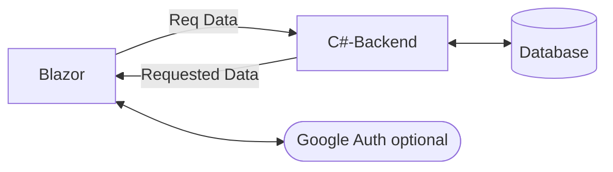
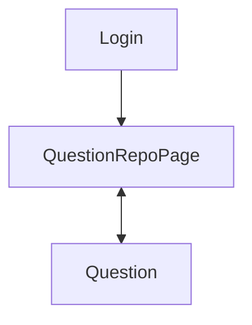
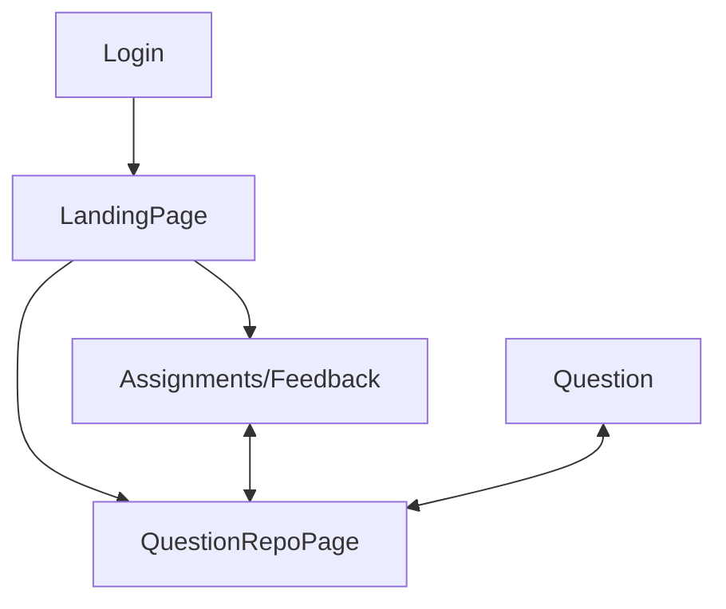
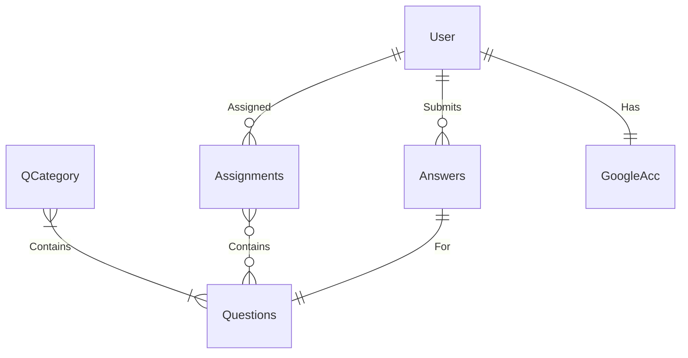
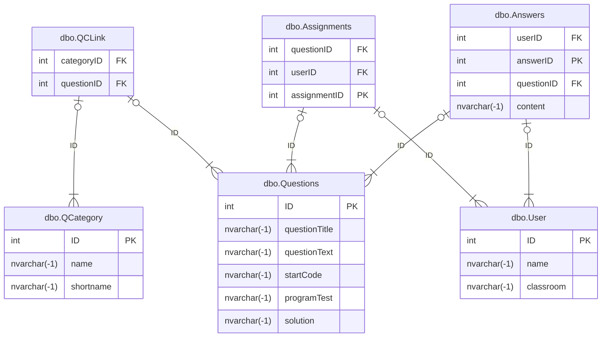

## Analysis
### The Product

- The product of my NEA project will be a dedicated website for computer science questions. This platform will enable teachers to assign questions to students, contribute their own questions to a central repository, and evaluate each student's progress effectively.
- From the student’s viewpoint, they will be able to log in using Google authentication. Once logged in, students can view their assigned tasks, access assignments, and respond to questions.

### The Research

- I have explored several educational platforms, including Duolingo and Isaac Physics/Computing, from a student’s perspective. This exploration has provided me with valuable insights into user interfaces and how to make the learning experience engaging and user-friendly.
- The questions integrated into the platform will be sourced from the computer science department at my school, ensuring relevance and alignment with the curriculum.

### The Client

- I have identified the computer science department as my primary client for testing this NEA project. Throughout the development process, I will be collaborating with and seeking feedback faculty members within the department to enhance the product.

### The Objectives
- **Must-Haves**
	1. Establish a reliable client-server connection.
	2. Create a comprehensive collection of questions.
	3. Ensure accessible question retrieval via the website.
- **Should-Haves** 
	1. Implement individual student authentication. 
	2. Enable teachers to receive submitted answers from students. 
	3. Facilitate storage of answers for future review.
	4. Allow teachers to modify existing questions and add new ones to the system.
- **Could-Haves** 
  	1. Utilise student-specific school Google accounts for authentication. 
### Success Criteria
1. **Must-Have Features**
	- **Reliable Client-Server Connection**:
	    - The website must establish a stable and secure connection between the Blazor front-end and the C# backend service.
	    - The backend should successfully communicate with the SQL server to fetch and return data.
	- **Comprehensive Question Database**:
	    - Create a robust and diverse set of computer science questions that cover various categories and difficulty levels.
	    - Each question should include necessary auxiliary information like test code, tables, or data references required for problem-solving.
	- **Question Retrieval System**:
	    - Implement a user-friendly interface that allows students to easily browse and access questions from different categories.
	    - Ensure the questions are displayed in an organised and accessible format, providing a seamless experience.
	    - SQL Server Procedures should be used to ensure a secure and safe connection to the DB
2. **Should-Have Features**
	- **Student Authentication System**:
	    - Implement a secure login system for individual student accounts to track their activity and ensure personalised experiences.
	    - Students should be able to register and log in using secure credentials.
	- **Submission Mechanism for Teachers**:
	    - Develop a feature that allows students to mark questions as completed or submit their work externally.
	    - Ensure that teachers can access and review submitted answers, with the ability to track student progress over time.
	- **Answer Storage and Progress Tracking**:
	    - Enable the backend system to store student answers and results for future reference.
	    - Implement a tracking mechanism for teachers to monitor overall student progress in the course.
	- **Question Management by Teachers**:
	    - Include an interface for teachers to modify existing questions or add new questions directly through the website.
	    - Ensure changes made by teachers are reflected in the system promptly.
3. **Could-Have Features**
	- **Google Account Authentication**:
	    - Integrate authentication using students' school Google accounts for a streamlined and secure login process.
	    - Attach their school accounts to their progress, so they can visualise how many questions they've answered
4. **Overall Success Indicators**
	- A fully functional Blazor website with seamless integration between the front-end, C# backend, and SQL server.
	- User accounts for students with secure login functionality.
	- A comprehensive question repository accessible to students, with capabilities for teachers to manage content.
### Model Designs
#### Basic System Graph

#### Site Map
##### Basic

##### Ideal


##### Loose Page Requirements
- Login page
	- Must contain some form of identification
	- Starting point of the service
- QuestionRepoPage
	- A page containing all of the questions
	- The questions should be assorted by category
- Question
	- Should show the question
	- Provide all following information
	- Have some way to store the answer to the question
- Assignments (Optional)
	- Should show assigned questions from teachers
	- Have a way to access marking and feedback from teachers
- Assignments
        - Should allow students to view answers have written
   	- Should be able to select other students if teacher
### Framework Design

#### Requirements
| Requirement ID | Description                                                                                                                                            | Category             |
| -------------- | ------------------------------------------------------------------------------------------------------------------------------------------------------ | -------------------- |
| REQ1           | There should be a web platform for the user to view and use                                                                                            | Layout               |
| REQ2           | There should be 6 pages: Landing, Questions, Categories, Assignments, DisplayQuestion, and Answers                                                     | Layout               |
| REQ3           | The landing page should restrict navigation by hiding the navigation menu options unless logged in                                                     | Landing              |
| REQ4           | The landing page should also have a login button                                                                                                       | Landing              |
| REQ5           | When the login button is pressed, the user should be prompted to login using google authentication                                                     | Login                |
| REQ6           | If an account does not exist, an account should be made automatically on the behalf of the user                                                        | Login                |
| REQ7           | Once logged in, buttons for navigation should be visible on the left                                                                                   | Layout               |
| REQ8           | A student user should be allowed navigation to 4 pages from any other page once logged in: Categories, Questions, Assignments, and Answers/Feedback    | Layout               |
| REQ9           | A student user should be taken automatically to assignments on login                                                                                   | Login                |
| REQ10          | If the user has assignments due, they should be present in a table                                                                                     | Assignments          |
| REQ11          | The table should have navigable links to each relevant question page                                                                                   | Assignments          |
| REQ12          | If there are no assignments due, then a message as "No assignments" should be displayed                                                                | Assignments          |
| REQ12          | The categories page should have a table displaying the question categories                                                                             | Categories           |
| REQ13          | Each category should have relevant data displayed, such as the ID and name                                                                             | Categories           |
| REQ14          | Each category should have a navigable link that takes you to the questions page                                                                        | Categories           |
| REQ15          | When navigating from the categories links to the questions page, the questions should be filtered to the specified category                            | Categories/Questions |
| REQ16          | The question page should display a table displaying the questions                                                                                      | Questions            |
| REQ17          | The table should display relevant data such as the ID, name, and question text                                                                         | Questions            |
| REQ18          | Each question should have a navigable link that takes you to the specified question page                                                               | Questions/Question   |
| REQ19          | The question page should contain all of the relevant data, such as starting code, examples, tests, text, and any other relevant information if present | DisplayQuestion      |
| REQ20          | If the data is not present in the database, it should remain hidden                                                                                    | DisplayQuestion      |
| REQ21          | There should be a text-box for the user to insert their answer into                                                                                    | DisplayQuestion      |
| REQ22          | There should be a button at the bottom of the question page which allows the user to submit their answer for the question                              | DisplayQuestion      |
| REQ23          | The question page should confirm whether or not the answer was submitted successfully                                                                  | DisplayQuestion      |
| REQ24          | If there was an error submitting the answer, a potential reason should be explained in the confirmation                                                | DisplayQuestion      |
| REQ25          | From every page there should be a button to log out                                                                                                    | Layout               |
| REQ26          | The name of the logged-in user should be displayed at the top of every page                                                                            | Layout               |
| REQ27          | The answer page should have dropdown(s) to view submitted questions                                                                                    | Answers              |
| REQ28          | If the user is a student, they should only have access to a single dropdown containing their own questions, therefore the user dropdown remains hidden | Answers              |
| REQ29          | If the user is a teacher, they should have access to an additional menu which allows the teacher to specify a user, then effecting the question menu   | Answers              |

#### ERD

### Technical Design
#### Technologies Used

| Name                                                       | Description                                     |
| ---------------------------------------------------------- | ----------------------------------------------- |
| Dotnet                                                     | C# Environment required to build the website    |
| Blazor                                                     | C# Library used to build dynamic web pages      |
| ASP-NET.OpenAPI                                            | Connectivity between frontend and backend       |
| SQL server (Microsoft SQL)                                 | Database to store all required data/information |
| IIS Server                                                 | Webserver used to serve the page                |
| HTTP Data Stream                                           | Data format used to exchange data               |
| Bootstrap                                                  | CSS Library used to improve frontend            |
| GoogleAuth<br>(Microsoft.AspNetCore.Authentication.Google) | Used to authenticate the users                  |

#### Database
- Users
- Questions
- QuestionCategories 
- Assignments
- Answers (potentially)

##### Table Descriptions
###### Answers

|Field Name|Type|Purpose|Constraints|
|---|---|---|---|
|userID|int|unique foreign key for the user who submitted the answer|FK|
|answerID|int|unique primary key to identify the answer submitted|autoincremented, PK|
|questionID|int|unique foregin key for the question the answer is related to|FK|
|content|nvarchar(MAX)|the content of the answer submitted by the user|no constraints|

###### Assignments

|Field Name|Type|Purpose|Constraints|
|---|---|---|---|
|questionID|int|unique foreign key for the question that the assignment refers to|FK|
|userID|int|unique foreign key that relates to the user that the assignment is for|FK|
|assignmentID|int|unique primary key for each assignment|autoincremented, PK|
|dueDate|date|the due date of the assignment|allow null|

###### QCategory

|Field Name|Type|Purpose|Constraints|
|---|---|---|---|
|ID|int|unique ID referencing the question categories|autoincrememnted, PK|
|name|nvarchar(MAX)|the name of the category|no constraints|
|shortname|nvarchar(MAX|the short codename for the category, e.g INT|no constraints|

###### QCLink

|Field Name|Type|Purpose|Constraints|
|---|---|---|---|
|categoryID|int|unique foreign key to referrence a category|FK, cluster PK|
|quesionID|int|unique foreign key to referrence a question|FK, cluster PK|

###### Question

|Field Name|Type|Purpose|Constraints|
|---|---|---|---|
|ID|int|unique primary key to referrence a question|PK, autoincremented|
|questionTitle|nvarchar(MAX)|title of the question|no constraints|
|questionText|nvarchar(MAX)|the question itself|no constraints|
|startCode|nvarchar(MAX)|starting code of the question|no constraints|
|programTest|nvarchar(MAX)|the test program for the question|no constrainsts|
|solutions|nvarchar(MAX)|the solution to the question|no constraints|

###### User

|Field Name|Type|Purpose|Constraints|
|---|---|---|---|
|ID|int|unique primary key for the related user|autoincremented,PK|
|name|nvarchar(MAX)|name of the user|no constraints|
|email|nvarchar(MAX)|email of the user|no constraints|
|teacher|bit|whether or not the user should have access to teacher tools|default value: 0|

#### Framework Design


#### Algorithms
##### API
1. **Get Categories** (`GET /categories`): Fetches a list of categories from the database.
2. **Get Questions by Category** (`GET /questions/{categoryID}`): Retrieves a list of questions based on a given category ID, or all questions if no category ID is provided.
3. **Get Specific Question** (`GET /questions/{categoryID}/{questionID}`): Retrieves a specific question based on both category and question ID.
4. **Verify User** (`POST /verifyuser`): Verifies if a user exists in the database based on their email.
5. **Create User** (`POST /createuser`): Creates a new user with a provided name and email.
6. **Submit Answer** (`POST /submit`): Submits a user's answer to a specific question and deletes an assignment if it’s marked as completed.
7. **Get Assignments** (`POST /assignments`): Retrieves assignments for a user based on their email, including details like due dates.
8. **Get Users** (`GET /users`): Retrieves a list of all users with additional info such as whether they are a teacher.
9. **Get User's Answers** (`GET /answers/{userID}`): Fetches all the answers provided by a user.
###### Pseudocode

1. **Get Categories** (GET /categories)
   - **Action**: Connect to SQL database, query the `QCategory` table, and return the list of categories.
   ```plaintext
   Function GetCategories():
       Open SQL connection
       Execute query: SELECT ID, name, shortname FROM dbo.QCategory
       While reading data:
           Add each category to categoryList
       Return categoryList
   ```

2. **Get Questions by Category** (GET /questions/{categoryID})
   - **Action**: Fetch questions from a specific category or all questions.
   ```plaintext
   Function GetQuestionsByCategory(categoryID):
       Open SQL connection
       If categoryID is not 0:
           Execute query to get questions by categoryID
       Else:
           Execute query to get all questions
       While reading data:
           Add each question to questionList
       Return questionList
   ```

3. **Get Specific Question** (GET /questions/{categoryID}/{questionID})
   - **Action**: Fetch a specific question based on questionID.
   ```plaintext
   Function GetQuestion(categoryID, questionID):
       Open SQL connection
       Execute query to get question by questionID
       While reading data:
           Create question object with details
       Return question object
   ```
4. **Verify User** (POST /verifyuser)
   - **Action**: Check if a user exists based on their email.
   ```plaintext
   Function VerifyUser(email):
       Open SQL connection
       Execute query to find user by email
       If user found:
           Return user ID
       Else:
           Return -1 (not found)
   ```

5. **Create User** (POST /createuser)
   - **Action**: Insert a new user into the database.
   ```plaintext
   Function CreateUser(user):
       Open SQL connection
       Execute query to insert new user (name, email)
       Close connection
   ```

6. **Submit Answer** (POST /submit)
   - **Action**: Submit an answer to a question and potentially remove an assignment if the answer is marked as completed.
   ```plaintext
   Function SubmitAnswer(answer):
       Open SQL connection
       Insert answer into the Answers table
       If answer.assignment is true:
           Delete assignment from the Assignments table
       Close connection
   ```

7. **Get Assignments** (POST /assignments)
   - **Action**: Retrieve assignments for a user and calculate due dates.
   ```plaintext
   Function GetAssignments(email):
       Open SQL connection
       Fetch user ID based on email
       Fetch assignments for the user
       For each assignment:
           Calculate due date (in weeks/days)
       Return assignment list with due dates
   ```

8. **Get Users** (GET /users)
   - **Action**: Fetch all users.
   ```plaintext
   Function GetUsers():
       Open SQL connection
       Execute query to fetch users (ID, name, email, teacher status)
       While reading data:
           Add each user to userList
       Return userList
   ```

9. **Get User's Answers** (GET /answers/{userID})
   - **Action**: Fetch all answers submitted by a user.
   ```plaintext
   Function GetUserAnswers(userID):
       Open SQL connection
       Execute query to fetch answers for userID
       While reading data:
           Add each answer to answerList
       Return answerList
   ```
##### MainLayout
Component Layout:

  Initialize:
    - Retrieve user claims from HttpContext (e.g., Name, Email)
    - If user is authenticated:
        - Extract Name and Email from claims
        - Display Name and Email in the top row
    - If user is NOT authenticated:
        - Display "Login" link

  Main Layout:
    - Sidebar:
        - Render navigation menu (NavMenu)
    - Top Bar:
        - Display Name and Email if authenticated
        - Show Logout link if authenticated
        - Show Login link if NOT authenticated
    - Content Area:
        - Render the page content passed via @Body

  Error Handling:
    - Show error message with reload option if an unhandled error occurs

###### Pseudocode
```
Function OnInitializedAsync():
    - Get userClaims from HttpContextAccessor
    - If userClaims is not null:
        - Find Email claim using ClaimTypes.Email
        - If Email claim exists:
            - Set email = Email claim value
        - Find Name claim using ClaimTypes.GivenName
        - If Name claim exists:
            - Set name = Name claim value

```

##### Assignments
Page Initialization:
  - On page load:
    - Retrieve the user's email from the claims.
    - If email is found, make an API call to fetch assignments.
    - If email is not found, display error message ("Email claim not found").
  - API Request:
    - Send POST request to "/assignments" with the user's email.
    - If request is successful, store the list of assignments in `assignmentList`.
    - If request fails, display error message.

Display Assignments:
  - If assignmentList is empty, show "No Assignments!".
  - If assignmentList is not empty, display the assignments in a table:
    - For each assignment:
      - Show ID, Title (with a link), Text, Due Date, and Remaining Time (in weeks and days).
###### Pseudocode
```
Function OnInitializedAsync():
    - Get userClaims from HttpContextAccessor
    - If userClaims is available:
        - Extract Email claim
        - If Email claim exists:
            - Set email to Email claim value
        - Else:
            - Set status to "Email claim not found."
    - Else:
        - Set status to "User or Claims not available."
    
    - Prepare request data with Email
    - Send POST request to "/assignments"
    - If successful:
        - Set assignmentList to the received response
    - Else:
        - Set status to "Failed to load the question data."
```
```
Function RenderAssignments():
    - If assignmentList is empty:
        - Show message "No Assignments!"
    - Else:
        - For each assignment in assignmentList:
            - Render assignment details (ID, Title, Text, Due Date, Remaining Time)
```

##### Categories
Page Initialization:
  - On page load:
    - Send GET request to "/categories" to retrieve categories.
    - Parse the response as a list of categoryClass.
    - If categories are retrieved, update the UI to display the categories.
    - If categories are not retrieved, show "Loading..." message.

Display Categories:
  - If categoryList is empty:
    - Show "Loading..."
  - If categoryList is not empty:
    - Display categories in a table (ID, Name, Shortname).
###### Pseudocode
```
Function OnInitializedAsync():
    - Send GET request to "/categories"
    - If successful:
        - Set categoryList to the received response
    - Else:
        - Set status to "Failed to load categories."
```
```
Function RenderCategories():
    - If categoryList is empty:
        - Show message "Loading..."
    - Else:
        - For each category in categoryList:
            - Render category details (ID, Name, Shortname)
            - Make category name a clickable link
```
##### DisplayQuestion
Page Initialization (OnInitializedAsync):
1. Send GET request to "/questions/{CategoryID}/{QuestionID}" to retrieve question data.
2. If the question is found:
	- Display question details (title, text, start code, and program test).
3. If an error occurs during question retrieval:
   	- Set status to "Failed to load question data."

Submit Answer (Submit):
1. Check if the email is available:
	- If no, show error "Email is not available!"
2. Send POST request to "/verifyuser" with email to verify the user.
3. If verification is successful:
	- Parse the userID from the response.
	- If userID is valid:
   		- Submit the answer to the "/submit" endpoint along with questionID, userID, and content.
		- Disable the input fields and display a success message.
	- If verification fails:
		- Display error message: "Email verification failed."

Error Handling:
    - Handle all exceptions with a descriptive error message.
###### Pseudocode
```
Function OnInitializedAsync():
    - Try to get question data from "/questions/{CategoryID}/{QuestionID}".
    - If successful, store the question data and display it.
    - If failed, set status to "Failed to load the question data."
```
```
Function Submit():
    - Check if email is available:
        - If not, show error: "Email is not available!"
    - Send POST request to "/verifyuser" with email for verification.
    - If verification is successful:
        - Parse the user ID.
        - If the user ID is valid, send the answer to "/submit".
        - If invalid, show error: "Email verification failed!"
    - Catch any exceptions and display an error message.
```
##### Questions
Page Initialization (OnInitializedAsync):
1. Check if CategoryID is provided:
	- If CategoryID != 0:
		- Fetch questions using GET request to "/questions/{CategoryID}".
	- Else:
		- Fetch all questions using GET request to "/questions/0".
2. Store the retrieved questions in questionList.
3. If no questions are found, display "Loading...".
4. Render a table with columns: ID, Title, Text.
	- For each question, display the ID, Title (as a link), and Text.

Rendering the Question List:
1. If questionList is empty, display loading message.
2. If questionList contains data, render a table with:
   	- ID
   	- Title (link to the question details page)
	- Text (a short description)
###### Pseudocode
```
Function OnInitializedAsync():
    - If CategoryID != 0:
        - Fetch questions using GET request to "/questions/{CategoryID}".
    - Else:
        - Fetch all questions using GET request to "/questions/0".
    - Store the retrieved questions into questionList.
    - If questionList is empty, display "Loading...".
    - Render a table with the list of questions.
```
##### SubmittedAnswers
Function OnInitializedAsync():
- Fetch current user claims (email, name).
- Fetch user list from "/users".
	- If the user is a teacher, display user dropdown for selecting a student.
	- If the user is a student, fetch their answers.

Function OnUserChanged(ChangeEventArgs e):
- Get selected user ID from the dropdown.
- Fetch answers for the selected user from "/answers/{userID}".
- Reset question and answer display.

Function OnQuestionChanged(ChangeEventArgs e):
- Get selected question ID from the dropdown.
- Fetch the question details using "/questions/0/{questionID}".
- Display the selected question and answer.

Function FormatAnswer(input):
- Replace newline characters with "<br />" for HTML display.
###### Pseudocode
```
Function OnInitializedAsync():
    1. Get current user claims (email, name).
    2. Check if the user is a teacher.
        - If yes, fetch the user list from "/users".
        - If no, fetch answers for the current student from "/answers/{userID}".
```
```
Function OnUserChanged(ChangeEventArgs e):
    1. Get selected user ID.
    2. Fetch answers for the selected user using "/answers/{userID}".
    3. Reset question and answer display.
```
```
Function OnQuestionChanged(ChangeEventArgs e):
    1. Get selected question ID.
    2. Fetch question details from "/questions/0/{questionID}".
    3. Display the selected question and its corresponding answer.
```
```
Function FormatAnswer(input):
    - Replace newline characters with "<br />" for proper HTML display.
```

### Technical Solution
#### Installation instructions & Source Code
Due to the private nature of the GitHub repository, the source code is shared via a platform called [wirps](https://wirps.com/).

**To download the zip file of the repository, visit [this link](https://wirps.com/rhJ8Sf) (https://wirps.com/rhJ8Sf)**

In order to run the project, you will need:
- .NET 8.0 (or greater)
- A separate Microsoft SQL server configured with DDL file and SQL import data (TBA) that is connectable

**Installation instructions**
1. Extract the zip file downloaded from wirps
2. Open the folder named "NEA API"
3. Open the `Program.cs` file in your chosen editor
4. Within the connection string builder, insert your own connection credentials
5. Open two command prompts
	1. In the first command prompt, navigate to "NEA Website"
	2. In the second command prompt, navigate to "NEA API"
6. Use `dotnet watch` in each of the command prompts to run the respective programs
	- It is suggested that the API is started first
7. In the website command prompt, once the website is started, it should reveal an address to the website frontend
8. Open the address in your chosen web browser
9. You should have successfully ran the program, and are now looking at the frontend website for the project!

#### Overview
##### Technologies used
- Blazor
	- I chose Blazor as a learning exercise since we have learned C# for A level. I thought it would be challenging to learn these skills during this project
- `Microsoft.AspNetCore.OpenApi`
	- Used for the back-end to create the API, allowing the Blazor website to communicate with the SQL server
- Microsoft SQL
	- The SQL provider used for my project, chosen as it aligns with the existing database system used by my school
##### Communication
The Blazor front-end communicates with the REST API through various HTTP requests. 

When requesting data, the majority of the parameters required are stored in the request URL, such as "`/questions/{CategoryID}`". In other cases such as `/verifyUser` where an email containing special characters is involved, the data is sent in a header payload instead.

The data received from the SQL server on the back-end is converted into a class, which is then serialised into a JSON request, which is then deserialised back into the class on the Blazor page to be used programatically.

When writing data, the data is sent as a POST request, which is then converted and handled on the back-end
##### Data Storage
All relevant data is stored in the SQL server, or in the case of some of the google authentication data, is stored in the browser's cache. There are a series of SQL requests that directly interface with the SQL server in the back-end program, that handle the reading and writing of data. 

#### Folder and File structure
- NEA Website
	- Authentication
		- `AccessDenied.razor`
		- `AfterLoginpage.razor`
		- `AppConstants.cs`
		- `LoginPage.razor`
		- `LogoutPage.razor`
	- Components
		- Layout
			- `MainLayout.razor`
			- `MainLayout.razor.css`
			- `NavMenu.razor`
			- `Navmenu.razor.css`
		- Pages
			- `Assignments.razor`
			- `Categories.razor`
			- `DisplayQuestion.razor`
			- `Error.razor`
			- `Home.razor`
			- `Questions.razor`
			- `SubmittedAnswers.razor`
		- `App.razor`
		- `Routes.razor`
		- `_Imports.razor`
	- Properties
		- `launchsettings.json`
	- `Program.cs`
	- `appsettings.Development.json`
	- `appsettings.json`
	- `NEAWebsite.csproj`
	- `NEAWebsite.sln`
	- *(all other files will be generated on initial runtime)*
- NEA API
	- Program.cs
	- *(all other files will be generated on initial runtime)*
#### Key Features and Code Implementation
##### Back-end API (Program.cs) - Data access and Core Functionality
###### Purpose and Overview
- The `Program.cs` file in the back-end API acts as the **main entry point** for handling HTTP requests from the Blazor front-end. It defines all the **endpoints** that the front-end interacts with, performing CRUD operations on the SQL database. These endpoints are responsible for fetching questions, submitting answers, handling user authentication, and managing assignments.
- The API uses **minimal API architecture** provided by ASP.NET Core, and it connects to a SQL Server database using `SqlConnection` and `SqlCommand`. All routes are exposed via HTTP and tested with Swagger (enabled in development mode).
###### Establishing the Database Connection

```csharp
SqlConnectionStringBuilder sqlBuilder = new SqlConnectionStringBuilder();
sqlBuilder.DataSource = "SQL SERVER HERE"; 
sqlBuilder.UserID = "SQL USERNAME HERE";            
sqlBuilder.Password = "SQL PASSWORD HERE";     
sqlBuilder.InitialCatalog = "INITIAL CATALOG HERE";
sqlBuilder.TrustServerCertificate=true;

using SqlConnection connection = new SqlConnection(sqlBuilder.ConnectionString);
```

- An `SqlConnectionStringBuilder` is used to build a connection string
	- The database used is specified in the builder, as well as the username and password
	- `TrustServerCertificate=true` ensures that the connection doesn't fail due to an untrusted certificate in a development environment
- The connection is reused across all endpoints, and is opened and closed per request to avoid connection leaks
- In a production version, the password would ideally be stored in an environment variable or secure secrets store
###### Get Categories

```csharp
app.MapGet("/categories", () => {
    connection.Open();       
    String sql = "SELECT ID, name, shortname FROM dbo.QCategory";
    ...
    return categoryList;    
})
```

- This endpoint retrieves all question categories from the `QCategory` table, returning the list of `categoryClass` objects. This supports the front-end feature allowing the users to filter the questions by category
###### Get Questions (with Optional Filtering)#

```csharp
app.MapGet("/questions/{categoryID}", (int categoryID) => {
    ...
    if(categoryID != 0){
        sql = $"SELECT ... FROM dbo.Questions q JOIN dbo.QCLink qc ON q.ID = qc.questionID WHERE qc.categoryID = {categoryID}";
    } else {
        sql = $"SELECT ... FROM dbo.Questions";
    }
    ...
    return questionList;    
})
```

- If a categoryID is provided, questions are filtered using a join on a linking table `QCLink`
- Otherwise, it returns all questions
- This dynamic filtering supports the front-end category filtering feature

###### Get Specific Question

```csharp
app.MapGet("/questions/{categoryID}/{questionID}", ...)
```

- Returns a specific question by its ID
- Useful for displaying detailed question data when a student selects a question from one of the pages

###### User Verification

```csharp
app.MapPost("/verifyuser", (VerifyUserRequest request) =>
{
    ...
    sql = $"SELECT * FROM dbo.[User] WHERE email = '{email}'";
    ...
})
```

- After signing in via Google on the front-end, the user's email is posted here to check if they exist in the database
- The API returns the user ID if found, otherwise -1 (not found)

###### Create New User

```csharp
app.MapPost("/createuser", (userClass user) => {
    ...
    sql = $"INSERT INTO dbo.[User] (name, email) VALUES ('{user.name}','{user.email}')";
})
```

- If a user does not exist in the system, they are added to the database using this endpoint
- In practice, this endpoint is used to automatically create a new user if they do not already exist in the database

###### Submit Answer

```csharp
app.MapPost("/submit", (answerClass answer) => {
    ...
    sql = $"INSERT INTO dbo.Answers (userID, questionID, content) VALUES (...)";
    ...
})

```

- Students submit answers to questions using this endpoint
- If the answer is related to an assignment, the corresponding entry is deleted from the `Assignments` table to indicate completion

###### Fetch Assignments

```csharp
app.MapPost("/assignments", (VerifyUserRequest request) => {
    ...
    sql = $"SELECT questionID, dueDate FROM dbo.Assignments WHERE userID = {id}";
    ...
})
```

- This feature is for students: it fetches their assignment, calculates the time remaining (`WeeksAway` and `DaysAway`), and returns full question info
- Useful for visualising assignment deadlines on the website

###### View All Users

```csharp
app.MapGet("/users", () => {
    ...
    String sql = "SELECT ID, name, email, teacher FROM dbo.[User]";
})
```

- Returns a list of all users (students and teachers)
- Teachers can be distinguished by the teacher boolean flag

###### View Answers by User

```csharp
app.MapGet("/answers/{userID}", (int userID) => {
    ...
    sql = $"SELECT a.content, a.userID, a.questionID, q.questionTitle ...";
})
```

- Allows students to view their previously submitted answers
- Teachers can also use this to review answers from any student (based on the front-end)

###### Summary of Technologies Used
- `Microsoft.AspNetCore.OpenApi` for back-end endpoints
- MS-SQL Server as the relational database
- Swagger for API testing during development
- `Microsoft.Data.SqlClient`for direct SQL query execution

##### Front-end Website
###### Purpose and Overview
- The Blazor front-end is designed to create an interactive and dynamic web application for educational content management. It serves two primary user types: students and teachers, each having access to different features based on their roles
- For students, the platform provides:
	- A list of available questions to answer
	- The ability to submit answers for those questions
	- The ability to view their own previously submitted answers
	- The ability to view and answer assignments set by teachers
	- The ability to view the deadline and time remaining for the assignments
- For teachers, the platform offers:
	- The ability to view all students' answers with the option to filter by student, and then selecting a question

- The core features of the front-end include:
	- Authentication and Authorisation: Users authenticate using Google OAuth for secure login, and the app uses role-based authorisation to differentiate between teachers and students
	- Question and Answer Handling: The app allows students to view and answer questions, while the teachers can see all answers submitted by students.
	- Assignments: Teachers can set students assignments using the SQL database, which students can then view and answer accordingly

- The app is built using Blazor Server-Side Components and Razor Components, leveraging HTTP Client to interact with the back-end API. Both students and teachers have access to the tools they need according to their specific roles
- By using streaming rendering and dynamic content loading, it enables efficient, real-time updates on the UI without needing full page reloads. This makes the app feel more responsive and interactive, which is complementary for a modern web application focused on education

###### Features Breakdown
1. Authentication (Google OAuth and Cookie-based Authentication)
	- File(s): `Program.cs`, `Authentication/` 
	- Feature Description:
		- The application allows users to authenticate via Google Oauth
		- This is handled in `Progran.cs` where google authentication is set up using a client ID and secret
		- In `Home.razor`, the user is prompted to login. On login, the user is redirected to the assignments page. If they navigate back to the home page, their user info is displayed

		   ```csharp
			builder.Services.AddAuthentication(AppConstants.AuthScheme)
			    .AddCookie(AppConstants.AuthScheme, cookieOptions =>
			    {
			        cookieOptions.Cookie.Name = AppConstants.AuthScheme;
			    }).AddGoogle(GoogleDefaults.AuthenticationScheme, googleOptions =>
			    {
			        googleOptions.ClientId = "<Google_Client_Id>";
			        googleOptions.ClientSecret = "<Google_Client_Secret>";
			    });
			
			```

			```razor
			<Microsoft.AspNetCore.Components.Authorization.AuthorizeView>
				<NotAuthorized>
					Please login to view and answer questions
				</NotAuthorized>
				<Authorized>
					<h1>You are authenticated!</h1>
					<ul>
						<li>ID: @context.User.Claims.FirstOrDefault(c => c.Type == ClaimTypes.NameIdentifier)!.Value</li>
						<li>Email: @context.User.Claims.FirstOrDefault(c => c.Type == ClaimTypes.Email)!.Value</li>
						<li>Name: @context.User.Claims.FirstOrDefault(c => c.Type == ClaimTypes.GivenName)!.Value</li>
					</ul>
				</Authorized>
			</Microsoft.AspNetCore.Components.Authorization.AuthorizeView>
			```

2. Display Questions and Answers
	- File(s): `Categories.razor`, `Questions.razor`, `DisplayQuestions.razor`, `SubmittedAnswers.razor`
	- Feature Description:
		- Categories: `Categories.razor` fetches and displays a list of categories from the back-end API, and allows the user to select one. If they select a category, then they will be redirected to the questions page with a filter applied
		- Questions: `Questions.razor` fetches and displays a list of categories from the back-end API, and allows the user to select a specific question to view in greater detail and/or answer
		- Display Question: `DisplayQuestions.razor` displays detailed information for a specific question, including the question's title, text, and any associated code or other data. Users can submit their answers on this page
		- Answers: `SubmittedAnswers.razor` displays one or more drop-down menu(s) that can be used to specify a previously submitted answer. A teacher is able to select from any user, while a user can only select their own answers
		- Questions List
			```razor
			@foreach (questionClass question in questionList)
			{
			    <tr>
			        <td>@question.questionID</td>
			        <td><a href="/questions/@CategoryID/@question.questionID">@question.questionTitle</a></td>
			        <td>@question.questionText.Replace("\"\"","\"")</td>
			    </tr>
			}
			```
		- Display Question
			```razor
			<h2>@((MarkupString)@question.questionTitle.Replace("\"\"","\""))</h2>
			<h4>Question Text</h4>
			<p>@((MarkupString)@question.questionText.Replace("\"\"","\""))</p>
			```

3. Answer Submission
	- File: `DisplayQuestions.razor`
	- Feature Description:
		- This page allows the user to submit their answers, it includes form inputs for the user's answer and email, which are submitted to the server
		- Upon submission, the answer is sent to a back-end API endpoint for saving for future retrieval
			```razor
			<textarea class="form-control" rows="20" @bind="@answer" disabled="@IsDisabled"></textarea>
			<button class="btn btn-success" @onclick="Submit" disabled="@IsDisabled">Submit</button>
			```
			```csharp
			void Submit()
			{
			    // Submitting the answer logic here, too long for snippet...
			}
			```

4. Role-based User Interface (Student/Teacher)
	- `SubmittedAnswers.razor`
	- Feature Description:
		- Teacher Role: Teachers can select a user and view all answers submitted by them. This feature uses a set of drop-down menus to select the users and displays answers for that user
		- Student Role: Students can only view their own answers, and therefore only have one dropdown for their own answers
		- Depending on their role (determined from authentication claims), users are presented with different interface options and functionality
			```razor
			@if (isTeacher)
			{
			    <div>
			        <label for="userDropdown">Select a user:</label>
			        <select id="userDropdown" @onchange="OnUserChanged">
			            <option value="" disabled selected>Select a user</option>
			            @foreach (var user in userList)
			            {
			                <option value="@user.id">@user.name</option>
			            }
			        </select>
			    </div>
			}
			else
			{
			    <p>You are a student. Your ID: @currentUserId</p>
			}
			```
			```razor
			var selectedAnswers = userAnswers.Where(a => a.questionID == selectedAnswerId).ToList();
			@foreach (var answer in selectedAnswers)
			{
			    <div>
			        <p><strong>Answer ID: @answer.questionID</strong></p>
			        <pre>@((MarkupString)FormatAnswer(answer.content))</pre>
			    </div>
			}
			
			```
###### Technologies & Techniques Used
- Blazor WebAssembly & Blazor Server for the front-end framework. This app uses the Interactive Server Rendering
- Razor Syntax is used for creating dynamic HTML content with C#
- Google OAuth is used for user authentication and cookie-based session management
- HttpClient is used to make API request for fetching data from the database. The data is returned in JSON format and is deserialised into C# objects
- Role-based Authorisation is used so the UI adjusts based on whether the user is a teacher or a student, leveraging the claims in the authentication token to determine roles
- Standard HTML form elements such as `<select>`, `<input>`, and `<textarea>` to gather user input
- Dependency Injection is used to ensure services such as `HttpClient`, `IHttpContextAccessor` and `AuthenticationStateProvider` are injected into components
- Streaming and Interactive Rendering allows for real-time updates on the server-side without reloading the page, making the app more dynamic
- State management is used to ensure the UI updates correctly after data fetching and user interaction

#### SQL Design
##### Create Table Scripts
Answers
```SQL
SET ANSI_NULLS ON
GO
SET QUOTED_IDENTIFIER ON
GO
CREATE TABLE [dbo].[Answers](
	[userID] [int] NULL,
	[answerID] [int] IDENTITY(1,1) NOT NULL,
	[questionID] [int] NULL,
	[content] [nvarchar](max) NULL,
 CONSTRAINT [PK_Answers] PRIMARY KEY CLUSTERED 
(
	[answerID] ASC
)WITH (PAD_INDEX = OFF, STATISTICS_NORECOMPUTE = OFF, IGNORE_DUP_KEY = OFF, ALLOW_ROW_LOCKS = ON, ALLOW_PAGE_LOCKS = ON) ON [PRIMARY]
) ON [PRIMARY] TEXTIMAGE_ON [PRIMARY]
GO
ALTER TABLE [dbo].[Answers]  WITH CHECK ADD  CONSTRAINT [FK_Answers_Questions] FOREIGN KEY([questionID])
REFERENCES [dbo].[Questions] ([ID])
GO
ALTER TABLE [dbo].[Answers] CHECK CONSTRAINT [FK_Answers_Questions]
GO
ALTER TABLE [dbo].[Answers]  WITH CHECK ADD  CONSTRAINT [FK_Answers_User] FOREIGN KEY([userID])
REFERENCES [dbo].[User] ([ID])
GO
ALTER TABLE [dbo].[Answers] CHECK CONSTRAINT [FK_Answers_User]
GO
```
Assignments
```SQL
SET ANSI_NULLS ON
GO
SET QUOTED_IDENTIFIER ON
GO
CREATE TABLE [dbo].[Assignments](
	[questionID] [int] NULL,
	[userID] [int] NULL,
	[assignmentID] [int] IDENTITY(1,1) NOT NULL,
	[dueDate] [date] NULL,
 CONSTRAINT [PK_Assignments] PRIMARY KEY CLUSTERED 
(
	[assignmentID] ASC
)WITH (PAD_INDEX = OFF, STATISTICS_NORECOMPUTE = OFF, IGNORE_DUP_KEY = OFF, ALLOW_ROW_LOCKS = ON, ALLOW_PAGE_LOCKS = ON) ON [PRIMARY]
) ON [PRIMARY]
GO
ALTER TABLE [dbo].[Assignments]  WITH CHECK ADD  CONSTRAINT [FK_Assignments_Questions] FOREIGN KEY([questionID])
REFERENCES [dbo].[Questions] ([ID])
GO
ALTER TABLE [dbo].[Assignments] CHECK CONSTRAINT [FK_Assignments_Questions]
GO
ALTER TABLE [dbo].[Assignments]  WITH CHECK ADD  CONSTRAINT [FK_Assignments_User] FOREIGN KEY([userID])
REFERENCES [dbo].[User] ([ID])
GO
ALTER TABLE [dbo].[Assignments] CHECK CONSTRAINT [FK_Assignments_User]
GO
```
Question Category
```SQL
SET ANSI_NULLS ON
GO
SET QUOTED_IDENTIFIER ON
GO
CREATE TABLE [dbo].[QCategory](
	[ID] [int] IDENTITY(1,1) NOT NULL,
	[name] [nvarchar](max) NULL,
	[shortname] [nvarchar](max) NULL,
 CONSTRAINT [PK_QCategory] PRIMARY KEY CLUSTERED 
(
	[ID] ASC
)WITH (PAD_INDEX = OFF, STATISTICS_NORECOMPUTE = OFF, IGNORE_DUP_KEY = OFF, ALLOW_ROW_LOCKS = ON, ALLOW_PAGE_LOCKS = ON) ON [PRIMARY]
) ON [PRIMARY] TEXTIMAGE_ON [PRIMARY]
GO
```
Question-Category Link
```SQL
SET ANSI_NULLS ON
GO
SET QUOTED_IDENTIFIER ON
GO
CREATE TABLE [dbo].[QCLink](
	[categoryID] [int] NULL,
	[questionID] [int] NULL
) ON [PRIMARY]
GO
ALTER TABLE [dbo].[QCLink]  WITH CHECK ADD  CONSTRAINT [FK_QCLink_QCategory] FOREIGN KEY([categoryID])
REFERENCES [dbo].[QCategory] ([ID])
GO
ALTER TABLE [dbo].[QCLink] CHECK CONSTRAINT [FK_QCLink_QCategory]
GO
ALTER TABLE [dbo].[QCLink]  WITH CHECK ADD  CONSTRAINT [FK_QCLink_Questions] FOREIGN KEY([questionID])
REFERENCES [dbo].[Questions] ([ID])
GO
ALTER TABLE [dbo].[QCLink] CHECK CONSTRAINT [FK_QCLink_Questions]
GO
```
Questions
```SQL
SET ANSI_NULLS ON
GO
SET QUOTED_IDENTIFIER ON
GO
CREATE TABLE [dbo].[Questions](
	[ID] [int] IDENTITY(1,1) NOT NULL,
	[questionTitle] [nvarchar](max) NULL,
	[questionText] [nvarchar](max) NULL,
	[startCode] [nvarchar](max) NULL,
	[programTest] [nvarchar](max) NULL,
	[solution] [nvarchar](max) NULL,
 CONSTRAINT [PK_Questions] PRIMARY KEY CLUSTERED 
(
	[ID] ASC
)WITH (PAD_INDEX = OFF, STATISTICS_NORECOMPUTE = OFF, IGNORE_DUP_KEY = OFF, ALLOW_ROW_LOCKS = ON, ALLOW_PAGE_LOCKS = ON) ON [PRIMARY]
) ON [PRIMARY] TEXTIMAGE_ON [PRIMARY]
GO
```
User
```SQL
SET ANSI_NULLS ON
GO
SET QUOTED_IDENTIFIER ON
GO
CREATE TABLE [dbo].[User](
	[ID] [int] IDENTITY(1,1) NOT NULL,
	[name] [nvarchar](max) NULL,
	[classroom] [nvarchar](max) NULL,
	[email] [nvarchar](max) NULL,
 CONSTRAINT [PK_user] PRIMARY KEY CLUSTERED 
(
	[ID] ASC
)WITH (PAD_INDEX = OFF, STATISTICS_NORECOMPUTE = OFF, IGNORE_DUP_KEY = OFF, ALLOW_ROW_LOCKS = ON, ALLOW_PAGE_LOCKS = ON) ON [PRIMARY]
) ON [PRIMARY] TEXTIMAGE_ON [PRIMARY]
GO
```
##### SELECT Scripts
```SQL
FROM
```
