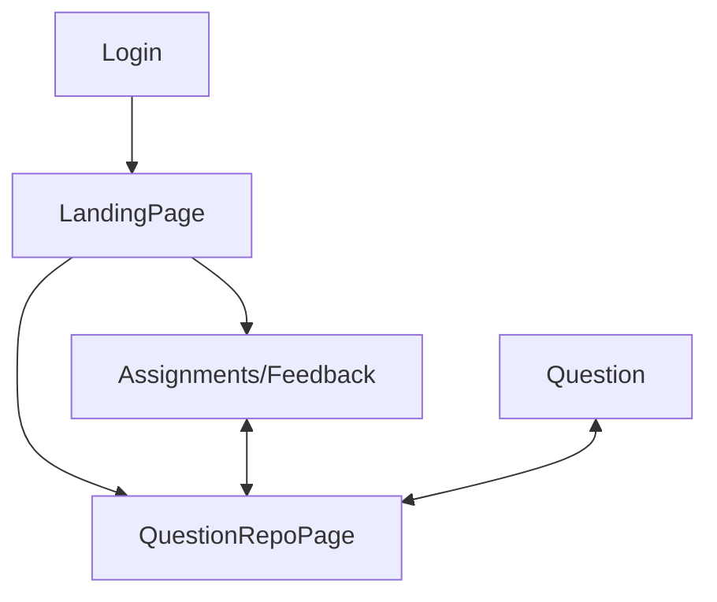
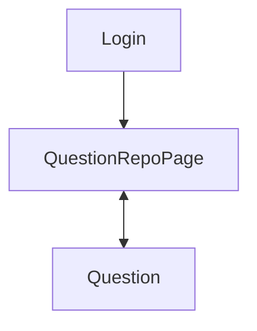
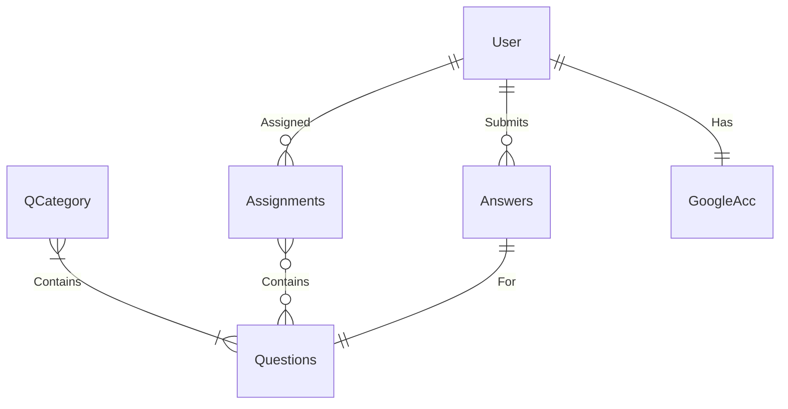
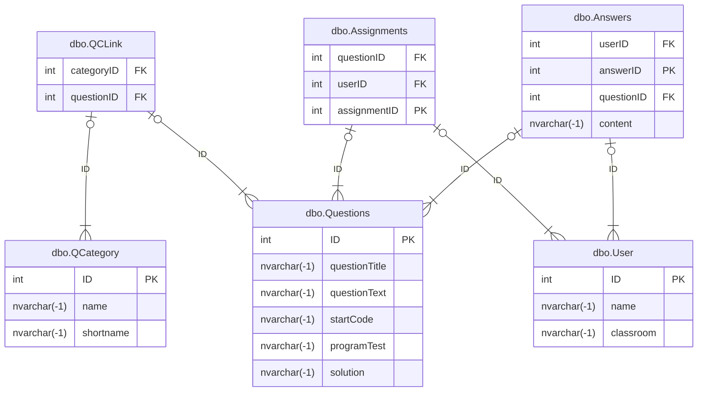

## Analysis
### The Product

- The product of my NEA project will be a dedicated website for computer science questions. This platform will enable teachers to assign questions to students, contribute their own questions to a central repository, and evaluate each student's progress effectively.
- From the student’s viewpoint, they will be able to log in using Google authentication. Once logged in, students can view their assigned tasks, access assignments, and respond to questions. The system may potentially automatically mark their answers, though this feature will only apply to questions with fixed, objective answers (i.e., not open-ended or interpretative writing).

### The Research

- I have explored several educational platforms, including Duolingo and Isaac Physics/Computing, from a student’s perspective. This exploration has provided me with valuable insights into user interfaces and how to make the learning experience engaging and user-friendly.
- The questions integrated into the platform will be sourced from the computer science department at my school, ensuring relevance and alignment with the curriculum.

### The Client

- I have identified the computer science department as my primary client for testing this NEA project. Throughout the development process, I will be collaborating with and seeking feedback faculty members within the department to enhance the product.

### The Objectives
- **Must-Haves**
	1. Establish a reliable client-server connection.
	2. Create a comprehensive collection of questions.
	3. Ensure accessible question retrieval via the website.
- **Should-Haves** 
	1. Implement individual student authentication. 
	2. Enable teachers to receive submitted answers from students. 
	3. Facilitate storage of answers for future review and track overall course progress.
	4. Allow teachers to modify existing questions and add new ones to the system.
- **Could-Haves** 
	1. Introduce randomised question variables to enhance variety and unpredictability. 
	2. Utilise student-specific school Google accounts for authentication. 
	3. Provide real-time feedback to students within the platform.
### Success Criteria
1. **Must-Have Features**
	- **Reliable Client-Server Connection**:
	    - The website must establish a stable and secure connection between the Blazor front-end and the C# backend service.
	    - The backend should successfully communicate with the SQL server to fetch and return data.
	- **Comprehensive Question Database**:
	    - Create a robust and diverse set of computer science questions that cover various categories and difficulty levels.
	    - Each question should include necessary auxiliary information like test code, tables, or data references required for problem-solving.
	- **Question Retrieval System**:
	    - Implement a user-friendly interface that allows students to easily browse and access questions from different categories.
	    - Ensure the questions are displayed in an organised and accessible format, providing a seamless experience.
	    - SQL Server Procedures should be used to ensure a secure and safe connection to the DB
2. **Should-Have Features**
	- **Student Authentication System**:
	    - Implement a secure login system for individual student accounts to track their activity and ensure personalised experiences.
	    - Students should be able to register and log in using secure credentials.
	- **Submission Mechanism for Teachers**:
	    - Develop a feature that allows students to mark questions as completed or submit their work externally.
	    - Ensure that teachers can access and review submitted answers, with the ability to track student progress over time.
	- **Answer Storage and Progress Tracking**:
	    - Enable the backend system to store student answers and results for future reference.
	    - Implement a tracking mechanism for teachers to monitor overall student progress in the course.
	- **Question Management by Teachers**:
	    - Include an interface for teachers to modify existing questions or add new questions directly through the website.
	    - Ensure changes made by teachers are reflected in the system promptly.
3. **Could-Have Features**
	- **Randomised Question Variables**:
	    - Implement dynamic question generation with variable elements to provide a unique experience for each student.
	    - Ensure that the variability does not compromise the integrity or difficulty of the questions.
	- **Google Account Authentication**:
	    - Integrate authentication using students' school Google accounts for a streamlined and secure login process.
	    - Attach their school accounts to their progress, so they can visualise how many questions they've answered
4. **Overall Success Indicators**
	- A fully functional Blazor website with seamless integration between the front-end, C# backend, and SQL server.
	- User accounts for students with secure login functionality.
	- A comprehensive question repository accessible to students, with capabilities for teachers to manage content.
	- Optional features that enhance user experience, such as variable questions and feedback, are implemented for further engagement.
### Model Designs
#### Basic System Graph

#### Site Map
##### Ideal

##### Basic

##### Loose Page Requirements
- Login page
	- Must contain some form of identification
	- Starting point of the service
- QuestionRepoPage
	- A page containing all of the questions
	- The questions should be assorted by category
- Question
	- Should show the question
	- Provide all following information
	- Have some way to store the answer to the question
- Assignments/Feedback (Optional)
	- Should show assigned questions from teachers
	- Have a way to access marking and feedback from teachers
#### Framework Design

#### Requirements
| Requirement ID | Description                                                                                                                                            | Category             |
| -------------- | ------------------------------------------------------------------------------------------------------------------------------------------------------ | -------------------- |
| REQ1           | There should be a web platform for the user to view and use                                                                                            | Layout               |
| REQ2           | There should be 8 pages: Landing, Questions, Categories, Assignments, Question, Answers, Teacher                                                       | Layout               |
| REQ3           | The landing page should restrict navigation by hiding the navigation menu options unless logged in                                                     | Landing              |
| REQ4           | The landing page should also have a login button                                                                                                       | Landing              |
| REQ5           | When the login button is pressed, the user should be prompted to login using google authentication                                                     | Login                |
| REQ6           | If an account does not exist, an account should be made automatically on the behalf of the user                                                        | Login                |
| REQ7           | Once logged in, buttons for navigation should be visible on the left                                                                                   | Layout               |
| REQ8           | A student user should be allowed navigation to 4 pages from any other page once logged in: Categories, Questions, Assignments, and Answers/Feedback    | Layout               |
| REQ9           | A student user should be taken automatically to assignments on login                                                                                   | Login                |
| REQ10          | If the user has assignments due, they should be present in a table                                                                                     | Assignments          |
| REQ11          | The table should have navigable links to each relevant question page                                                                                   | Assignments          |
| REQ12          | If there are no assignments due, then a message as "No assignments" should be displayed                                                                | Assignments          |
| REQ12          | The categories page should have a table displaying the question categories                                                                             | Categories           |
| REQ13          | Each category should have relevant data displayed, such as the ID and name                                                                             | Categories           |
| REQ14          | Each category should have a navigable link that takes you to the questions page                                                                        | Categories           |
| REQ15          | When navigating from the categories links to the questions page, the questions should be filtered to the specified category                            | Categories/Questions |
| REQ16          | The question page should display a table displaying the questions                                                                                      | Questions            |
| REQ17          | The table should display relevant data such as the ID, name, and question text                                                                         | Questions            |
| REQ18          | Each question should have a navigable link that takes you to the specified question page                                                               | Questions/Question   |
| REQ19          | The question page should contain all of the relevant data, such as starting code, examples, tests, text, and any other relevant information if present | Question             |
| REQ20          | If the data is not present in the database, it should remain hidden                                                                                    | Question             |
| REQ21          | There should be a text-box for the user to insert their answer into                                                                                    | Question             |
| REQ22          | There should be a button at the bottom of the question page which allows the user to submit their answer for the question                              | Question             |
| REQ23          | The question page should confirm whether or not the answer was submitted successfully                                                                  | Question             |
| REQ24          | If there was an error submitting the answer, a potential reason should be explained in the confirmation                                                | Question             |
| REQ25          | From every page there should be a button to log out                                                                                                    | Layout               |
| REQ26          | The name of the logged-in user should be displayed at the top of every page                                                                            | Layout               |

#### ERD

### Technical Design
#### Technologies Used

| Name                                                       | Description                                     |
| ---------------------------------------------------------- | ----------------------------------------------- |
| Dotnet                                                     | C# Environment required to build the website    |
| Blazor                                                     | C# Library used to build dynamic web pages      |
| ASP-NET.OpenAPI                                            | Connectivity between frontend and backend       |
| SQL server (Microsoft SQL)                                 | Database to store all required data/information |
| IIS Server                                                 | Webserver used to serve the page                |
| HTTP Data Stream                                           | Data format used to exchange data               |
| Bootstrap                                                  | CSS Library used to improve frontend            |
| GoogleAuth<br>(Microsoft.AspNetCore.Authentication.Google) | Used to authenticate the users                  |

#### Database
- Users
- Questions
- QuestionCategories 
- Assignments
- Answers (potentially)

#### Framework Design

#### SQL Design
##### Create Table Scripts
Answers
```SQL
SET ANSI_NULLS ON
GO
SET QUOTED_IDENTIFIER ON
GO
CREATE TABLE [dbo].[Answers](
	[userID] [int] NULL,
	[answerID] [int] IDENTITY(1,1) NOT NULL,
	[questionID] [int] NULL,
	[content] [nvarchar](max) NULL,
 CONSTRAINT [PK_Answers] PRIMARY KEY CLUSTERED 
(
	[answerID] ASC
)WITH (PAD_INDEX = OFF, STATISTICS_NORECOMPUTE = OFF, IGNORE_DUP_KEY = OFF, ALLOW_ROW_LOCKS = ON, ALLOW_PAGE_LOCKS = ON) ON [PRIMARY]
) ON [PRIMARY] TEXTIMAGE_ON [PRIMARY]
GO
ALTER TABLE [dbo].[Answers]  WITH CHECK ADD  CONSTRAINT [FK_Answers_Questions] FOREIGN KEY([questionID])
REFERENCES [dbo].[Questions] ([ID])
GO
ALTER TABLE [dbo].[Answers] CHECK CONSTRAINT [FK_Answers_Questions]
GO
ALTER TABLE [dbo].[Answers]  WITH CHECK ADD  CONSTRAINT [FK_Answers_User] FOREIGN KEY([userID])
REFERENCES [dbo].[User] ([ID])
GO
ALTER TABLE [dbo].[Answers] CHECK CONSTRAINT [FK_Answers_User]
GO
```
Assignments
```SQL
SET ANSI_NULLS ON
GO
SET QUOTED_IDENTIFIER ON
GO
CREATE TABLE [dbo].[Assignments](
	[questionID] [int] NULL,
	[userID] [int] NULL,
	[assignmentID] [int] IDENTITY(1,1) NOT NULL,
	[dueDate] [date] NULL,
 CONSTRAINT [PK_Assignments] PRIMARY KEY CLUSTERED 
(
	[assignmentID] ASC
)WITH (PAD_INDEX = OFF, STATISTICS_NORECOMPUTE = OFF, IGNORE_DUP_KEY = OFF, ALLOW_ROW_LOCKS = ON, ALLOW_PAGE_LOCKS = ON) ON [PRIMARY]
) ON [PRIMARY]
GO
ALTER TABLE [dbo].[Assignments]  WITH CHECK ADD  CONSTRAINT [FK_Assignments_Questions] FOREIGN KEY([questionID])
REFERENCES [dbo].[Questions] ([ID])
GO
ALTER TABLE [dbo].[Assignments] CHECK CONSTRAINT [FK_Assignments_Questions]
GO
ALTER TABLE [dbo].[Assignments]  WITH CHECK ADD  CONSTRAINT [FK_Assignments_User] FOREIGN KEY([userID])
REFERENCES [dbo].[User] ([ID])
GO
ALTER TABLE [dbo].[Assignments] CHECK CONSTRAINT [FK_Assignments_User]
GO
```
Question Category
```SQL
SET ANSI_NULLS ON
GO
SET QUOTED_IDENTIFIER ON
GO
CREATE TABLE [dbo].[QCategory](
	[ID] [int] IDENTITY(1,1) NOT NULL,
	[name] [nvarchar](max) NULL,
	[shortname] [nvarchar](max) NULL,
 CONSTRAINT [PK_QCategory] PRIMARY KEY CLUSTERED 
(
	[ID] ASC
)WITH (PAD_INDEX = OFF, STATISTICS_NORECOMPUTE = OFF, IGNORE_DUP_KEY = OFF, ALLOW_ROW_LOCKS = ON, ALLOW_PAGE_LOCKS = ON) ON [PRIMARY]
) ON [PRIMARY] TEXTIMAGE_ON [PRIMARY]
GO
```
Question-Category Link
```SQL
SET ANSI_NULLS ON
GO
SET QUOTED_IDENTIFIER ON
GO
CREATE TABLE [dbo].[QCLink](
	[categoryID] [int] NULL,
	[questionID] [int] NULL
) ON [PRIMARY]
GO
ALTER TABLE [dbo].[QCLink]  WITH CHECK ADD  CONSTRAINT [FK_QCLink_QCategory] FOREIGN KEY([categoryID])
REFERENCES [dbo].[QCategory] ([ID])
GO
ALTER TABLE [dbo].[QCLink] CHECK CONSTRAINT [FK_QCLink_QCategory]
GO
ALTER TABLE [dbo].[QCLink]  WITH CHECK ADD  CONSTRAINT [FK_QCLink_Questions] FOREIGN KEY([questionID])
REFERENCES [dbo].[Questions] ([ID])
GO
ALTER TABLE [dbo].[QCLink] CHECK CONSTRAINT [FK_QCLink_Questions]
GO
```
Questions
```SQL
SET ANSI_NULLS ON
GO
SET QUOTED_IDENTIFIER ON
GO
CREATE TABLE [dbo].[Questions](
	[ID] [int] IDENTITY(1,1) NOT NULL,
	[questionTitle] [nvarchar](max) NULL,
	[questionText] [nvarchar](max) NULL,
	[startCode] [nvarchar](max) NULL,
	[programTest] [nvarchar](max) NULL,
	[solution] [nvarchar](max) NULL,
 CONSTRAINT [PK_Questions] PRIMARY KEY CLUSTERED 
(
	[ID] ASC
)WITH (PAD_INDEX = OFF, STATISTICS_NORECOMPUTE = OFF, IGNORE_DUP_KEY = OFF, ALLOW_ROW_LOCKS = ON, ALLOW_PAGE_LOCKS = ON) ON [PRIMARY]
) ON [PRIMARY] TEXTIMAGE_ON [PRIMARY]
GO
```
User
```SQL
SET ANSI_NULLS ON
GO
SET QUOTED_IDENTIFIER ON
GO
CREATE TABLE [dbo].[User](
	[ID] [int] IDENTITY(1,1) NOT NULL,
	[name] [nvarchar](max) NULL,
	[classroom] [nvarchar](max) NULL,
	[email] [nvarchar](max) NULL,
 CONSTRAINT [PK_user] PRIMARY KEY CLUSTERED 
(
	[ID] ASC
)WITH (PAD_INDEX = OFF, STATISTICS_NORECOMPUTE = OFF, IGNORE_DUP_KEY = OFF, ALLOW_ROW_LOCKS = ON, ALLOW_PAGE_LOCKS = ON) ON [PRIMARY]
) ON [PRIMARY] TEXTIMAGE_ON [PRIMARY]
GO
```
##### SELECT Scripts
```SQL
FROM
```
